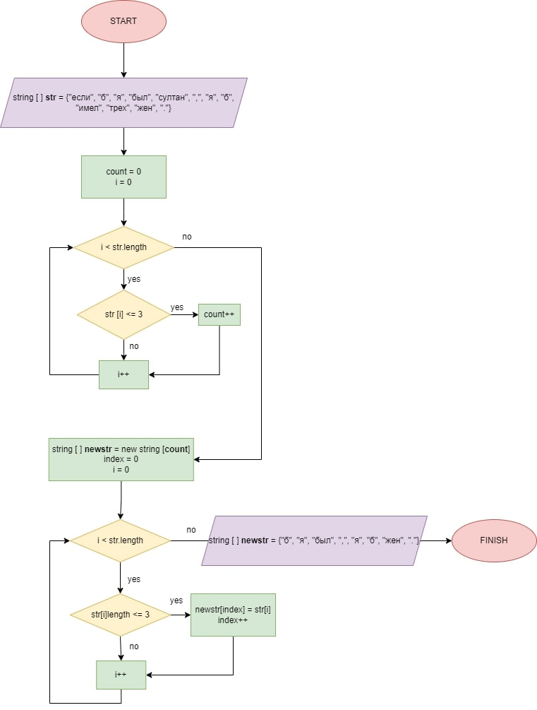

# Текстовое описание задачи:

## Условия задачи:
Написать программу, которая из имеющегося массива строк формирует массив из строк, длина которых меньше либо равна 3 символа. Первоначальный массив можно ввести с клавиатуры, либо задать на старте выполнения алгоритма. При решении не рекомендуется пользоваться коллекциями, лучше обойтись исключительно массивами.

## Краткий алгоритм решения: 

1. По условиям задачи, необходимо создать новый массив строк **(string [] (newstr))**, следовательно для этого сначала необходимо определить длину (размер) этого нового массива. С это целью необходимо, предварительно установив счетчик на «0», поочередно перебрать все элементы исходного (базового) массива **(string [] (str))**, сравнив длину каждого элемента с заданным значением (не более трех символов). При совпадении заданного условия (длина элемента меньше или равна 3), счетчик увеличивается на 1. Таким образом мы получаем длину нового массива строк. Для выполнения данной задачи мы используем метод ***int [] CountUniqueElements***.
2. Далее мы создаем новый массив (**newstr**) заданной длины, который заполняем, используя метод ***string [] GetNewStr***. В основе метода лежит поочередный перебор исходного массива и, в случае выполнения заданного условия (длина элемента менее или равно 3 символа), присвоение данного значения каждому последующему элементу нового массива (**string [] (newstr)**).
3. В результате при помощи метода печати массива ***void PrintArray*** выводим в консоль новый получившийся массив (**string [] (newstr)**).
4. Блок-схема алгоритма

